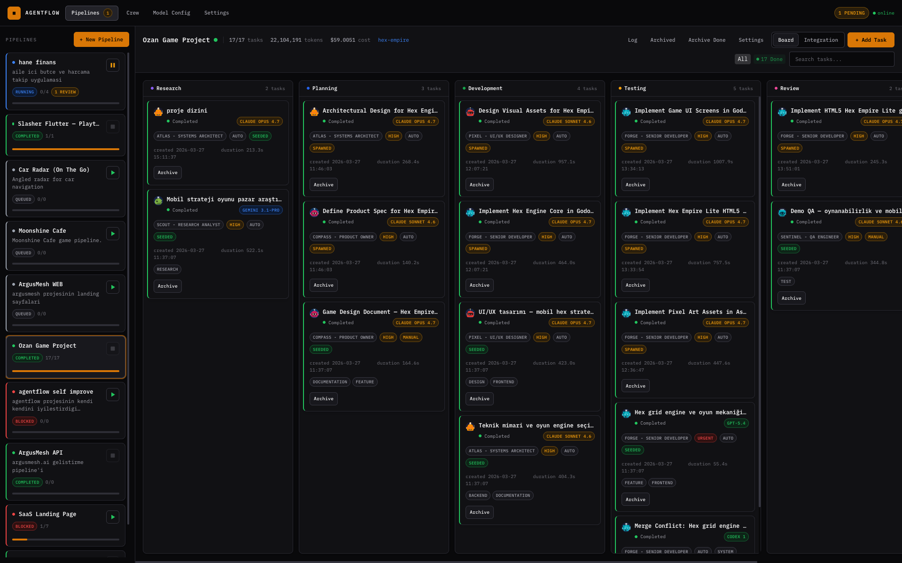

# AgentFlow

Pipeline-based orchestration for AI coding agents. Build multi-step task
graphs, run them with Claude Code, Codex, or Gemini CLI, and monitor the
whole workflow from a visual dashboard or over MCP.



## Project Status

AgentFlow is open source under Apache-2.0 and self-hostable today. Install
from source, run locally, drive it from a dashboard or over MCP. The first
public npm publish lands with the `v1.0.0` tag.

## Highlights

- Multi-agent execution for Claude Code, Codex CLI, and Gemini CLI
- Real-time dashboard for pipeline state, logs, outputs, and git diffs
- MCP server for programmatic pipeline control from compatible clients
- Git worktree isolation so tasks can run without stepping on each other
- Interactive execution for approvals, follow-up questions, and tool access
- Shared pipeline context with built-in persistence on SQLite
- Optional Slack and Telegram notifications

## Quick Start

### Requirements

- Node.js `^20.19.0` or `>=22.12.0`
- Git
- At least one supported AI CLI installed locally

### Install from source

```bash
git clone https://github.com/harun-yardimci/agentflow.git
cd agentflow
npm install
npm run dev
```

Open [http://localhost:3100](http://localhost:3100).

AgentFlow stores its default shared SQLite database at:

```text
~/.agentflow/agentflow.db
```

## Supported Agent CLIs

Install at least one of these tools before running pipelines:

- Claude Code: `npm install -g @anthropic-ai/claude-code`
- Codex CLI: `npm install -g @openai/codex`
- Gemini CLI: `npm install -g @google/gemini-cli`

## Development Commands

```bash
# Start frontend + backend with hot reload
npm run dev

# Start only the frontend
npm run dev:fe

# Start only the backend
npm run dev:be

# Run lint + typecheck
npm run lint

# Run standalone typecheck
npm run typecheck

# Run tests
npm test

# Build the frontend bundle
npm run build

# Start the MCP server (stdio)
npm run mcp

# Start the production server from source checkout
npm start
```

## MCP Usage

AgentFlow exposes an MCP server so compatible assistants can create and manage
pipelines programmatically.

Important runtime notes:

- `AGENTFLOW_PORT` is the AgentFlow app port, not the internal dev API port
- In development, the UI runs on `AGENTFLOW_PORT` and the backend on
  `AGENTFLOW_PORT + 1`
- By default, `npm run dev`, `npm start`, and `npm run mcp` share the same DB
  unless `AGENTFLOW_DB_PATH` is overridden

### Claude Code

```bash
claude mcp add agentflow --env AGENTFLOW_PORT=3100 -- node ./bin/cli.js mcp
```

### Claude Desktop / Cursor

Add this to your MCP config file:

```json
{
  "mcpServers": {
    "agentflow": {
      "command": "node",
      "args": ["./bin/cli.js", "mcp"],
      "env": {
        "AGENTFLOW_PORT": "3100"
      }
    }
  }
}
```

### Available MCP Tools

| Tool | Description |
|------|-------------|
| `list_pipelines` | List all pipelines with tasks and logs |
| `get_pipeline` | Get pipeline details by ID |
| `create_pipeline` | Create a new pipeline with optional tasks |
| `delete_pipeline` | Delete a pipeline |
| `add_task` | Add a task to a pipeline |
| `delete_task` | Delete a task |
| `approve_task` | Approve a pending task |
| `reject_task` | Reject a task |
| `move_task` | Move a task to a different status |
| `complete_task` | Complete a task and cascade to dependents |
| `run_pipeline` | Start pipeline execution |
| `list_agents` | List available agents |
| `update_agent` | Update agent configuration |
| `get_logs` | Get pipeline activity logs |
| `get_pipeline_context` | Read shared pipeline context |
| `set_pipeline_context` | Write to shared pipeline context |
| `list_pending_questions` | List pending interactive questions |
| `respond_to_question` | Respond to an interactive question |

## Architecture

```text
+------------------+     +-----------------+     +------------------+
|   React Frontend | --> | Express Backend | <-- |   MCP Server     |
|   (Vite + TW v4) |     | (REST API)      |     | (stdio / SSE)    |
+------------------+     +--------+--------+     +--------+---------+
                                  |                        |
                           +------+------+                 |
                           |   SQLite    | <---------------+
                           +------+------+
                                  |
                    +-------------+-------------+
                    |             |             |
              +-----------+ +-----------+ +-----------+
              | Claude CLI| | Codex CLI | | Gemini CLI|
              +-----------+ +-----------+ +-----------+
```

- Frontend: React 19, TypeScript strict mode, Tailwind CSS v4, Vite 7
- Backend: Express 5, better-sqlite3, Zod validation
- MCP: `@modelcontextprotocol/sdk` with stdio and SSE transports
- Execution: worker pool that spawns CLI processes inside isolated git worktrees

## Configuration

Environment variables are documented in [.env.example](.env.example).

| Variable | Default | Description |
|----------|---------|-------------|
| `PORT` | `3100` | AgentFlow app port |
| `AGENTFLOW_PORT` | `3100` | App port hint for MCP clients |
| `AGENTFLOW_DB_PATH` | `~/.agentflow/agentflow.db` | Override the shared SQLite DB path |
| `TELEGRAM_BOT_TOKEN` | — | Telegram notifications |
| `TELEGRAM_CHAT_ID` | — | Telegram destination chat |
| `SLACK_WEBHOOK_URL` | — | Slack webhook notifications |
| `SLACK_BOT_TOKEN` | — | Slack bot notifications |
| `SLACK_CHANNEL` | — | Slack channel target |

## Project Structure

```text
src/             Frontend (React components, hooks, context)
server/          Backend (Express routes, services, execution engine)
  db/            SQLite schema, connection, seed
  engine/        Task runner, worker pool, worktree manager
  executor/      CLI executor, templates, output parser
  routes/        REST API endpoints
  services/      Business logic
  safety/        Output safety checks
mcp/             MCP server
bin/             CLI entry point
tests/           Unit and integration tests
```

## Community

- Contributing guide: [CONTRIBUTING.md](CONTRIBUTING.md)
- Code of conduct: [CODE_OF_CONDUCT.md](CODE_OF_CONDUCT.md)
- Security policy: [SECURITY.md](SECURITY.md)
- Support guidance: [SUPPORT.md](SUPPORT.md)
- Transfer and publish checklist: [docs/release/repo-transfer-and-publish-checklist.md](docs/release/repo-transfer-and-publish-checklist.md)

## License

AgentFlow core is licensed under [Apache-2.0](LICENSE).
